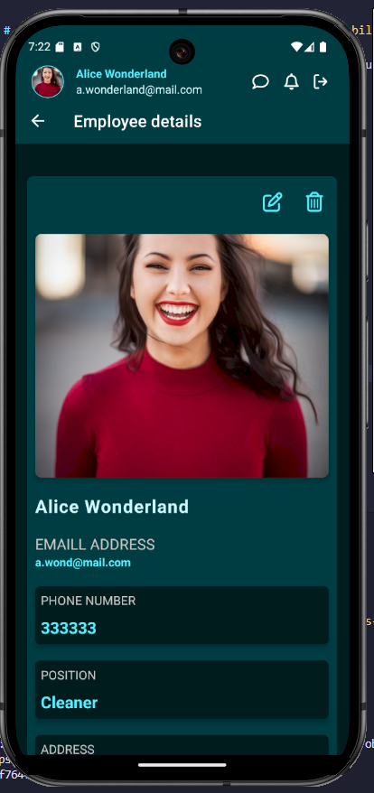

# Aurora Igloos Mobile App

This repository contains a frontend solution for my university coursework project. The frontend is build using React Native with Expo.This repository contains the frontend solution for my university coursework project. The application is built using React Native with Expo.

## Table of contents

- [Overview](#overview)
  - [Screenshot](#screenshot)
- [Getting started](#getting-started)
- [Author](#author)

### Screenshot

## Getting started

1. Clone the repository
2. Run `npm install`
3. Use auroraIgloos.bak file for database
4. Clone the [Aurora Igloos API – GitHub Repository] (https://github.com/patsy005/AuroraIgloosAPI)
5. Run the server
6. Run the emulator with `npx expo start -c`

## Author

- LinkedIn - [Patrycja Zawadzka](https://www.linkedin.com/in/patrycja-zawadzka-786836217/)
- Frontend Mentor - [@patsy005](https://www.frontendmentor.io/profile/patsy005)