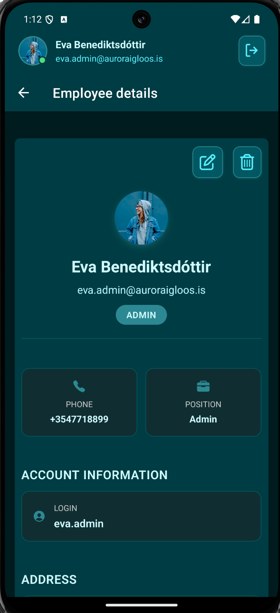

# Aurora Igloos Mobile App

This repository contains the mobile frontend for my university bachelor’s project **AuroraIgloos**.  
The application is designed as an internal system for employees of a company offering igloo glamping and guided trips in Iceland.

The app allows staff members to manage igloos, bookings, customers, employees, trips, and users.  
It also includes a built-in forum for internal communication.

The frontend is built using **React Native** with **Expo**, while the backend is implemented as a **.NET Web API** with **Entity Framework** and a **SQL** database.

---

## Table of contents

- [Overview](#overview)
  - [Screenshot](#screenshot)
- [Getting started](#getting-started)
- [Author](#author)

---

## Overview

AuroraIgloos is a comprehensive back-office solution created to support the daily operations of a glamping and travel company in Iceland.  
The system provides tools for managing accommodation availability, reservations, trips, and customer data, helping employees efficiently handle bookings and logistics.

---

### Screenshot

---

## Getting started

1. Clone the repository
2. Install dependencies using `npm install`
3. Use `AuroraIgloosEngineering.bak` file for database
4. Clone the [Aurora Igloos API – GitHub Repository] (https://github.com/patsy005/AuroraIgloosAPI)
5. Run the server
6. Run the emulator with `npx expo start -c`

## Author

- LinkedIn - [Patrycja Zawadzka](https://www.linkedin.com/in/patrycja-zawadzka-786836217/)
- Frontend Mentor - [@patsy005](https://www.frontendmentor.io/profile/patsy005)